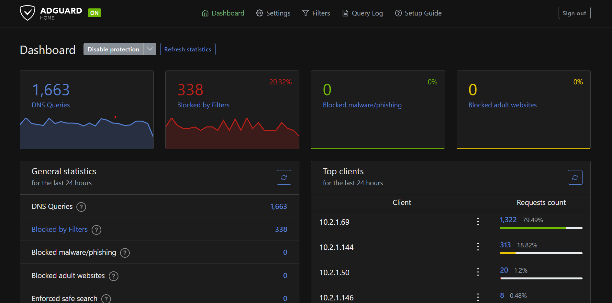
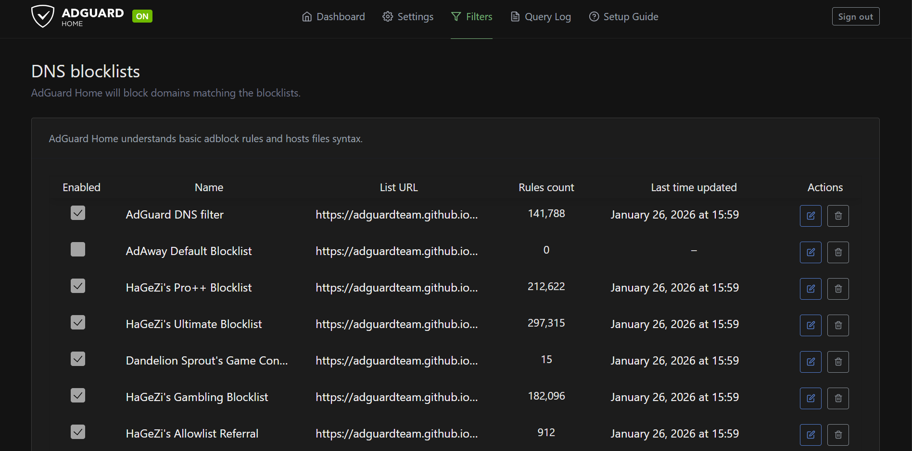

# AdGuard Home

## Overview

AdGuard Home runs as LXC 101 on Proxmox, providing DNS-level ad blocking and query logging for all VLANs.

## Configuration

| Setting | Value |
|---------|-------|
| Container ID | LXC 101 |
| IP Address | 10.2.1.x (VLAN 21) |
| DNS Port | 53 |
| Web UI Port | 3000 |

## DNS Flow

All VLANs point to AdGuard as their DNS server:
1. Client queries AdGuard (10.2.1.x)
2. AdGuard checks blocklists
3. If allowed, forwards to upstream (1.1.1.1 / 8.8.8.8)
4. Response returned to client

## Why LXC Instead of Docker?

- DNS needs to be available even if Docker host is down
- Lower resource overhead than a full VM
- Isolated from other services

## Screenshots

### AdGuard Dashboard

*AdGuard Home dashboard showing DNS activity, query statistics, and overall system status.*

### DNS Blocklists Configuration

*Configured DNS blocklists used by AdGuard Home to filter ads, trackers, and malicious domains across all VLANs.*