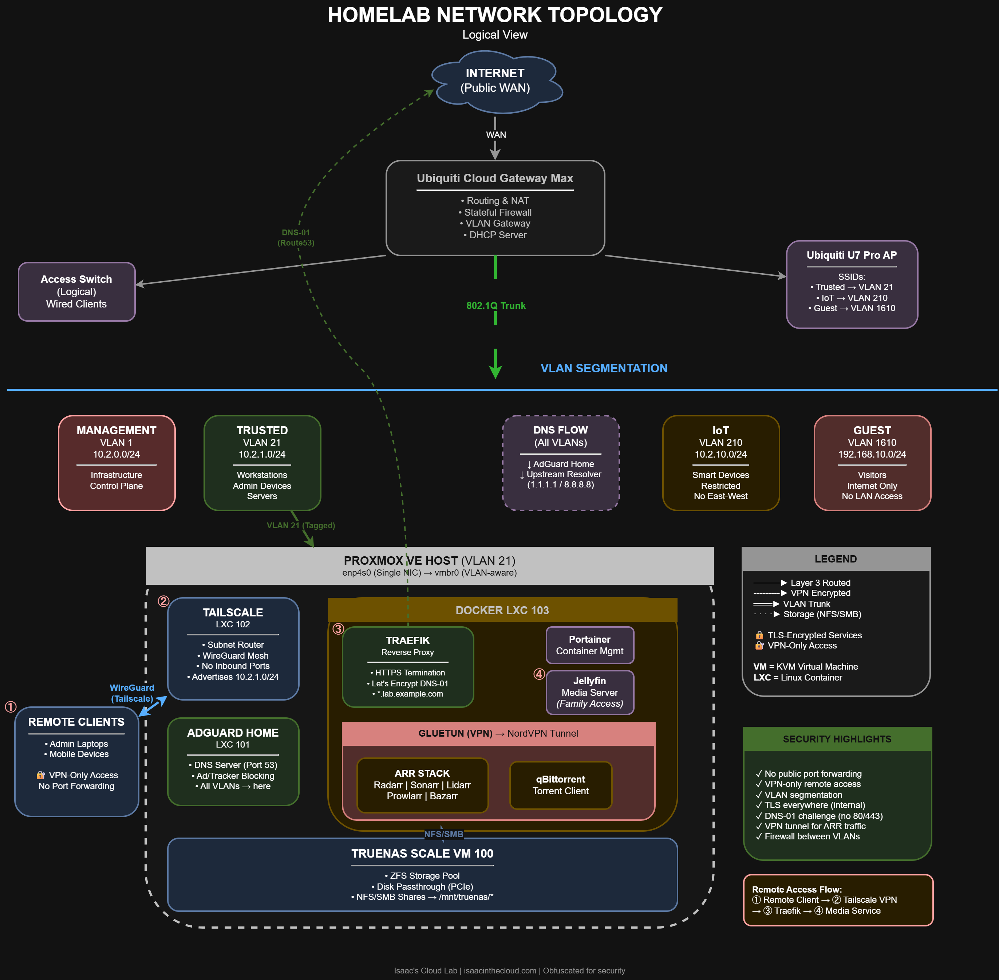
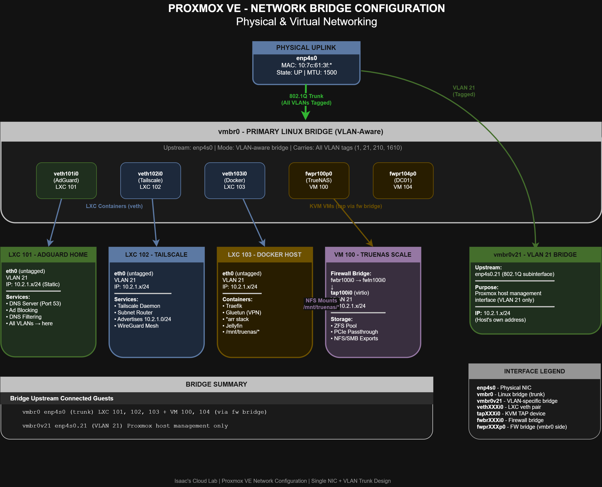
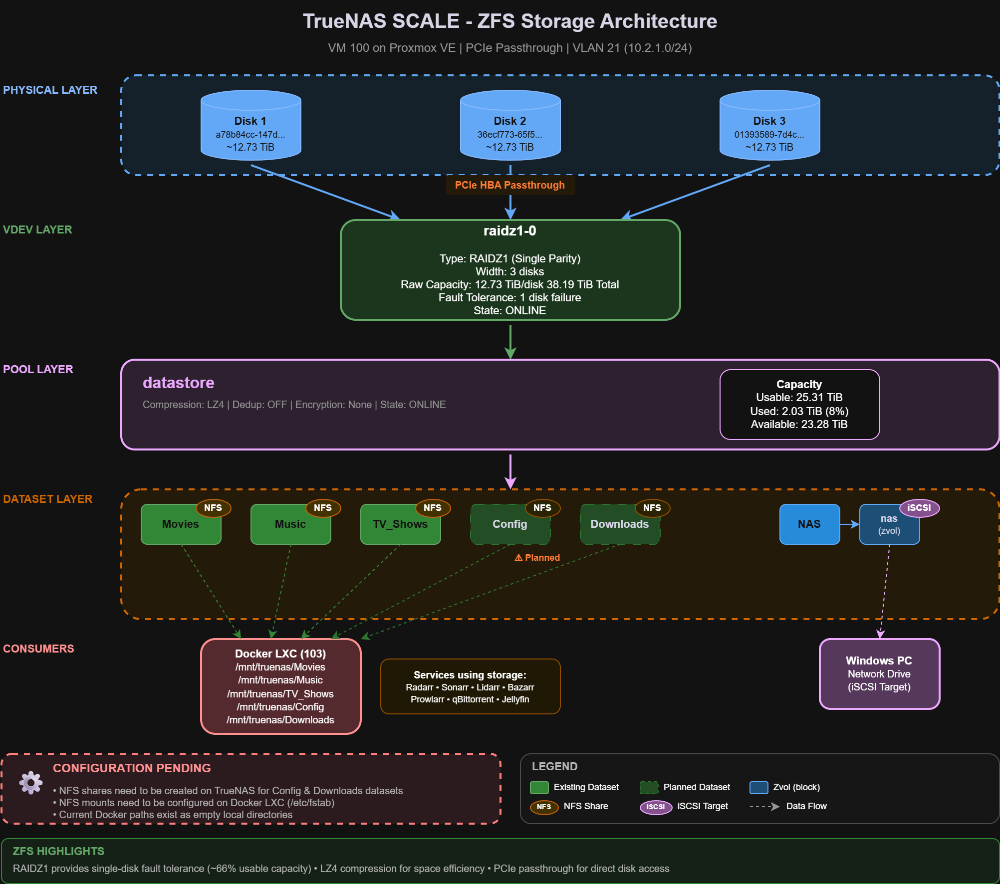
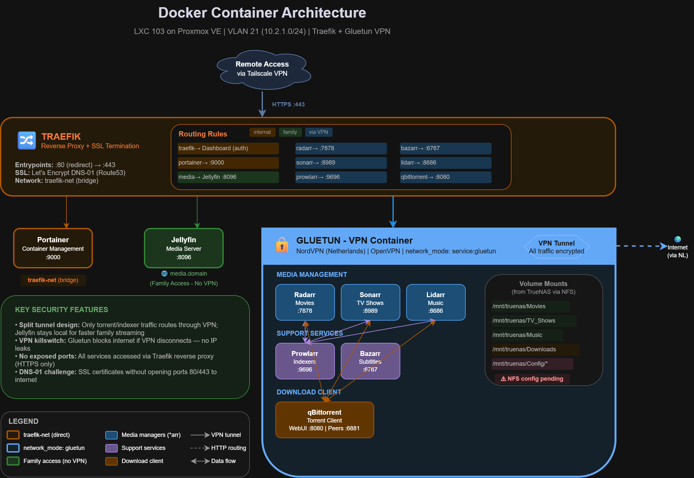

# Diagrams

This section contains architectural diagrams that document the homelab infrastructure at different layers, from network topology to application-level services.

## Network Topology (Logical View)

**Comprehensive logical network architecture illustrating the complete homelab infrastructure stack.**

**Edge Layer:**
- Ubiquiti Cloud Gateway Max serves as central routing and security enforcement point
- WAN connection to internet with DNS-01 certificate challenges via Route53
- Ubiquiti U7 Pro AP providing three SSIDs mapped to VLANs: Trusted (VLAN 21), IoT (VLAN 210), Guest (VLAN 1610)
- Logical access switch for wired clients

**Network Segmentation:**
- **Management VLAN 1** (10.2.0.0/24) - Infrastructure control plane
- **Trusted VLAN 21** (10.2.1.0/24) - Workstations, admin devices, servers
- **IoT VLAN 210** (10.2.10.0/24) - Smart devices with restricted east-west traffic
- **Guest VLAN 1610** (192.168.10.0/24) - Internet-only access for visitors

**Proxmox Virtualization Layer:**
- Proxmox VE host on VLAN 21 with single NIC (enp4s0)
- 802.1Q trunk carrying all VLAN tags through vmbr0 (VLAN-aware bridge)

**LXC Container Services:**
- **LXC 101 (AdGuard Home)** - DNS services to all VLANs, upstream resolvers 1.1.1.1/8.8.8.8
- **LXC 102 (Tailscale)** - Subnet router advertising 10.2.1.0/24, WireGuard mesh VPN for remote access
- **LXC 103 (Docker Host)** - Traefik reverse proxy with Let's Encrypt DNS-01, Portainer, Jellyfin media server, Gluetun VPN routing ARR Stack (Radarr, Sonarr, Lidarr, Prowlarr, Bazarr) and qBittorrent through NordVPN tunnel

**Virtual Machine:**
- **VM 100 (TrueNAS Scale)** - ZFS storage pool, PCIe disk passthrough, NFS/SMB shares at /mnt/truenas/*

**Security Highlights:**
- No public port forwarding
- VPN-only remote access via Tailscale
- Complete VLAN segmentation with firewall rules
- TLS everywhere for internal services
- DNS-01 challenge (no ports 80/443 exposed)
- DNSSEC validation enabled

**Remote Access Flow:**
Remote clients connect through Tailscale VPN, route to Traefik reverse proxy, then access internal media and management services.

---

## Proxmox Bridge Configuration

**Technical deep-dive showing Proxmox VE's physical and virtual networking layers.**

**Physical Layer:**
- Single NIC: enp4s0 (MAC: 10:7c:61:3f:*, State: UP, MTU: 1500)
- 802.1Q trunk carrying all VLANs (1, 21, 210, 1610)

**Bridge Layer:**
- **vmbr0** - Primary Linux bridge (VLAN-aware mode)
- Acts as trunk distribution point for all VMs and containers
- **vmbr0v21** - VLAN 21-specific bridge for Proxmox host management (IP: 10.2.1.x/24)

**LXC Container Network Interfaces:**
- **veth1010/0** (green) - LXC 101 (AdGuard Home)
  - VLAN 21, IP: 10.2.1.x/24
  - Services: DNS Server (Port 53), Ad Blocking, DNS Filtering
  
- **veth1020/0** (blue) - LXC 102 (Tailscale)
  - VLAN 21, IP: 10.2.1.x/24
  - Services: Subnet Router, WireGuard Mesh, advertising 10.2.1.0/24
  
- **veth1030/0** (orange) - LXC 103 (Docker Host)
  - VLAN 21, IP: 10.2.1.x/24
  - Containers: Traefik, Gluetun VPN, ARR Stack, Jellyfin
  - Storage: Mount points at /mnt/truenas/*

**Virtual Machine Network Interfaces:**
- **fwpr100p0** (yellow) - VM 100 (TrueNAS Scale)
  - Firewall bridge: fwbr100i0 -> fwln100i0
  - tap100i0 (virtio) on VLAN 21
  - Services: ZFS Pool, PCIe Passthrough, NFS/SMB Exports
  
- **fwpr104p0** (purple) - VM 104 (DC01)
  - Similar firewall bridge architecture
  - VLAN 21 connectivity

**Bridge Summary:**
- vmbr0 (enp4s0 trunk): LXC 101, 102, 103 + VM 100, 104 (via firewall bridge)
- vmbr0v21 (enp4s0.21): Proxmox host management only

**Interface Legend:**
- enp4s0: Physical NIC
- vmbr0: Linux bridge (trunk)
- vethXXXi0: LXC veth pairs
- tapXXXi0: KVM TAP devices
- fwbrXXXi0: Firewall bridges

---

## TrueNAS ZFS Storage Architecture

**Detailed ZFS storage architecture for TrueNAS Scale VM 100 with PCIe passthrough.**

**Physical Layer - Seagate Exos X14 Enterprise Disks:**
- **Disk 1:** a78b84cc-147d... (~12.73 TiB)
- **Disk 2:** 36ecf773-65f5... (~12.73 TiB)
- **Disk 3:** 01393589-7d4c... (~12.73 TiB)
- Connection: PCIe HBA Passthrough (bypassing Proxmox virtualization)
- Benefits: Direct hardware access, SMART monitoring, optimal ZFS performance

**VDEV Layer - RAIDZ1 Configuration:**
- **VDEV:** raidz1-0
- **Type:** RAIDZ1 (Single Parity)
- **Width:** 3 disks
- **Raw Capacity:** 38.19 TiB total (12.73 TiB per disk)
- **Fault Tolerance:** Survives 1 disk failure
- **State:** ONLINE

**Pool Layer:**
- **Name:** datastore
- **Compression:** LZ4 (enabled)
- **Deduplication:** OFF
- **Encryption:** None
- **State:** ONLINE
- **Usable Capacity:** 25.31 TiB
- **Used:** 2.03 TiB (8%)
- **Available:** 23.28 TiB

**Dataset Layer - ZFS Datasets:**
- **Movies** (NFS) - Movie media files
- **Music** (NFS) - Audio media files
- **TV_Shows** (NFS) - TV series files
- **Config** (NFS) - Application configurations
- **Downloads** (NFS) - Download staging area
- **NAS** (zvol) - iSCSI block storage
  - **nas** (nested) - iSCSI target

**Consumers:**
- **Docker LXC (103)** - NFS mounts to /mnt/truenas/*
  - /mnt/truenas/Movies
  - /mnt/truenas/Music
  - /mnt/truenas/TV_Shows
  - /mnt/truenas/Config
  - /mnt/truenas/Downloads
  - Services: Radarr, Sonarr, Lidarr, Bazarr, Prowlarr, qBittorrent, Jellyfin
  
- **Windows PC** - iSCSI network drive (nas zvol)

**Configuration Pending:**
- NFS shares need creation on TrueNAS for Config & Downloads datasets
- NFS mounts need configuration on Docker LXC 103
- Current Docker paths exist as empty local directories

**ZFS Highlights:**
- RAIDZ1: Single-disk fault tolerance, ~66% usable capacity
- LZ4 compression: Space efficiency without performance penalty
- PCIe passthrough: Direct disk access for optimal performance

---

## Docker Container Architecture

**Comprehensive Docker orchestration diagram for LXC 103 with Traefik and Gluetun VPN integration.**

**Remote Access Layer:**
- Entry via Tailscale VPN
- HTTPS traffic on port 443 to Traefik reverse proxy

**Traefik Reverse Proxy Configuration:**
- **Network:** traefik-net (bridge)
- **SSL:** Let's Encrypt DNS-01 certificates (Route53)
- **Entrypoints:** Port 80 redirects to 443
- **Services Exposed:**
  - traefik (Dashboard, authentication) - :9000
  - portainer (Container Management) - :9000
  - media (Jellyfin) - :8096

**Routing Rules by Category:**
- **Internal Services** (orange, traefik-net):
  - Traefik Dashboard (authenticated) - :9000
  - Portainer (Container Management) - :9000
  
- **Family Services** (green, no VPN):
  - Jellyfin Media Server - :8096
  - Direct local access for faster streaming
  - Domain: media.domain
  
- **VPN-Routed Services** (blue, via Gluetun):
  - radarr (Movies) - :7878
  - sonarr (TV Shows) - :8989
  - prowlarr (Indexers) - :9696
  - bazarr (Subtitles) - :6767
  - lidarr (Music) - :8686
  - qbittorrent (Torrents) - :8080

**Gluetun VPN Container:**
- **Provider:** NordVPN (Netherlands)
- **Protocol:** OpenVPN
- **Network Mode:** service:gluetun
- **Security:** VPN killswitch (blocks internet if VPN disconnects)
- **Tunnel:** All traffic encrypted before reaching internet

**Services Within Gluetun Boundary:**

*Media Management:*
- Radarr (Movies) - :7878
- Sonarr (TV Shows) - :8989
- Lidarr (Music) - :8686

*Support Services:*
- Prowlarr (Indexers) - :9696
- Bazarr (Subtitles) - :6767

*Download Client:*
- qBittorrent (Torrent Client)
- WebUI: :8080, Peers: :6881

**Volume Mounts from TrueNAS (NFS):**
- /mnt/truenas/Movies
- /mnt/truenas/TV_Shows
- /mnt/truenas/Music
- /mnt/truenas/Downloads
- /mnt/truenas/Config/*
- *Note: NFS configuration pending*

**Key Security Features:**
- **Split Tunnel Design:** Only torrent/indexer traffic routes through VPN; Jellyfin stays local for family streaming
- **VPN Killswitch:** Gluetun blocks internet if VPN disconnects, preventing IP leaks
- **No Exposed Ports:** All services accessed via Traefik reverse proxy (HTTPS only)
- **DNS-01 Challenge:** SSL certificates without opening ports 80/443 to internet

**Network Architecture:**
- Orange: traefik-net (direct connection)
- Blue: network_mode: gluetun (VPN-routed)
- Green: Family access (no VPN required)
- Purple: Support services
- Brown: Download client

---

## Obfuscation Policy

These diagrams intentionally omit or anonymize:
- Public IP addresses
- Real domain names
- VPN or overlay network node identifiers
- Cloud account identifiers

CIDR ranges and VLAN IDs are included, as they are not considered sensitive for documentation purposes.
