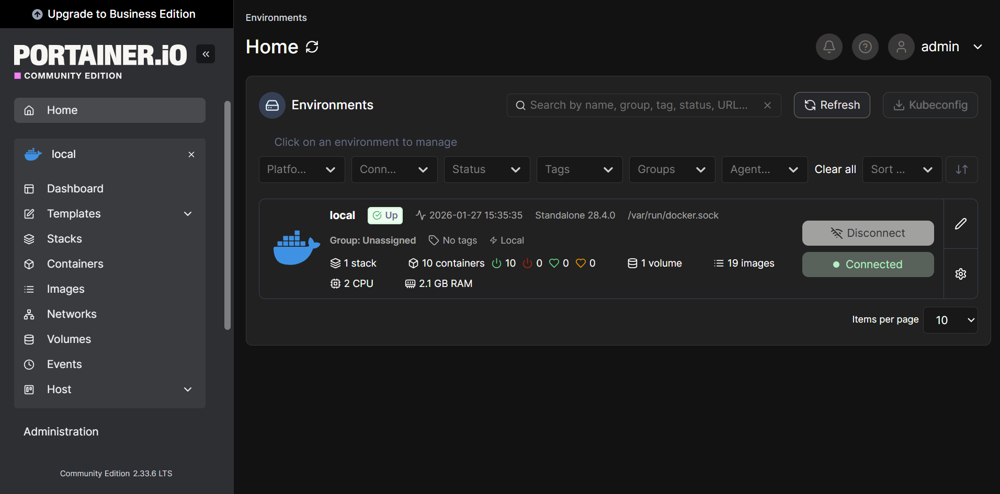

# Media Stack

## Overview

The media stack consists of the ARR suite for automated media management, qBittorrent for downloads, and Jellyfin for media streaming. All download-related traffic is routed through a Gluetun VPN container to enforce network isolation and prevent traffic leaks.

## Components

| Service     | Purpose                  | Port |
|-------------|--------------------------|------|
| Gluetun     | VPN container (NordVPN)  | -    |
| Radarr      | Movie management         | 7878 |
| Sonarr      | TV show management       | 8989 |
| Prowlarr    | Indexer management       | 9696 |
| qBittorrent | Torrent client           | 8080 |
| Jellyfin    | Media server             | 8096 |

## Network Architecture

- All ARR services and qBittorrent route traffic through the Gluetun VPN tunnel
- Jellyfin remains on the local network to provide fast, reliable streaming to household devices
- Gluetun kill switch prevents any outbound traffic if the VPN tunnel disconnects

## Storage Mounts

All containers mount shared storage from TrueNAS via NFS:

- `/mnt/truenas/Config/*` — Application configuration data
- `/mnt/truenas/Movies` — Movie library
- `/mnt/truenas/TV_Shows` — TV library
- `/mnt/truenas/Downloads` — Download staging area

## Screenshots

### Portainer Media Stack Overview

*Portainer dashboard showing the running media stack containers, including Gluetun, ARR services, and Jellyfin.*

### Jellyfin Dashboard

*Jellyfin web interface displaying the media libraries, used for local media streaming.*

## Disclaimer

This repository and its documentation are provided **for educational and infrastructure demonstration purposes only**.

- No guidance is provided on acquiring copyrighted material
- The author does **not** condone or support piracy
- All media management and streaming tools shown here are intended for use with **legally obtained content only**

Users are responsible for ensuring compliance with all applicable laws and service terms in their jurisdiction.
